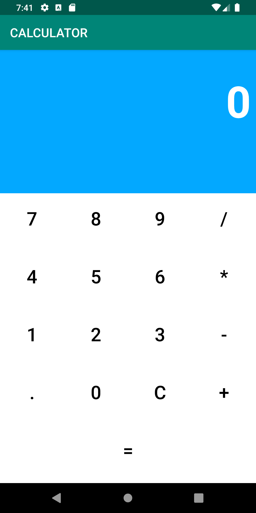

# Weekend1HW
Research and Calculator Coding Project

Weekend Homework Part 1: Research word file is uploaded into the repository's root as: Weekend1Homework - Research.docx.

Homework Part 2: Calculator Coding Project

Create a calculator app to perform all the standard calculator operations like addition, subtraction, multiplication, divide etc. 
 -No edittexts
 -Changing the orientation to landscape(layout qualifier) will display now functionality (Scientific calculator)
 Hint: Create all buttons using Relative/Grid Layout and append the values to the TextView. Show the result in a separate TextView.

Instructions:

- Run the Android project
- Create a new Virtual Device if not already. Then, choose Pixel 2 XL, then click OK.
- The calculator has two different orientation: Portrait and Landscape.
- Users may do addition, substraction, division, multiplication, decimal point and equals to sign.
- On Landscape mode, users are able to use it as a scientific calculator.
- Users may do log, ln, %, square root, sin, cos, tan and pie.

